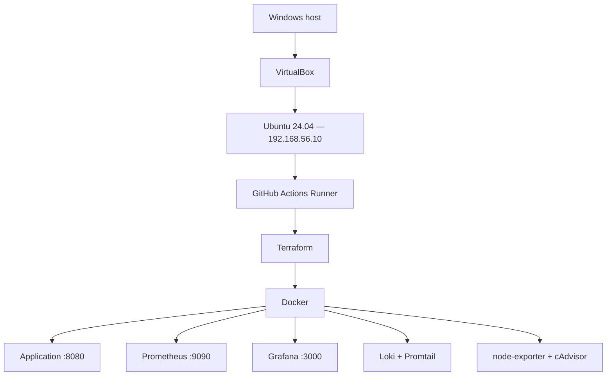

# DevOps Graduate Project — Local Infrastructure

This repository contains the complete infrastructure as code without AWS.
Vagrant creates an Ubuntu 24.04 virtual machine in VirtualBox, provisioning
prepares the operating system, and Terraform manages all Docker containers.

## Architecture



## Managed resources

- Ubuntu 24.04 VM with 2 CPUs and 4 GB RAM,
- private host-only network `192.168.56.0/24`,
- Docker and Docker Compose,
- Terraform and a GitHub Actions Runner,
- Java application container,
- Prometheus, Grafana, Loki, and Promtail,
- node-exporter and cAdvisor,
- persistent data volumes and a dedicated Docker network,
- automatically provisioned Grafana dashboard.

## Requirements

- VirtualBox 7,
- Vagrant,
- Git,
- a GitHub account.

No AWS account, payment card, or AWS SSO configuration is required. All
resources run on the local computer.

## Create the environment from scratch

Run the following commands in the infrastructure repository:

```bash
vagrant up
vagrant ssh
```

The first run downloads Ubuntu and installs the required packages, so it takes
longer. Later runs reuse the existing VM.

Inside the VM, verify the installed tools:

```bash
docker --version
terraform version
```

## Register the GitHub Actions Runner

1. Create a public infrastructure repository named exactly
   `devops-graduate-infrastructure`.
2. In the application repository, open
   `Settings → Actions → Runners → New self-hosted runner`.
3. Select Linux and x64, then copy the short-lived registration token.
4. In the VM, run:

   ```bash
   cd /vagrant
   ./scripts/register-runner.sh \
     https://github.com/YOUR_USERNAME/devops-graduate-app \
     ONE_TIME_TOKEN
   ```

Enter the registration token directly in the VM. Do not store it in a file or
commit it to the repository.

After registration, the `devops-local-vm` runner should have the `Idle` status
and the `devops-local` label.

## Validate Terraform

After creating the VM, validate the infrastructure without deploying an image:

```bash
cd /vagrant
terraform init
terraform fmt -check
terraform validate
```

The first deployment is performed by the pipeline after a push to `main`. It
passes the GHCR image to Terraform and stores state in
`/opt/devops-terraform/terraform.tfstate`. Reapplying the same configuration
reaches the same desired state instead of creating duplicate resources.

## Access from Windows

| Service | URL |
|---|---|
| application | `http://192.168.56.10:8080` |
| health check | `http://192.168.56.10:8080/health` |
| Grafana | `http://192.168.56.10:3000` |
| Prometheus | `http://192.168.56.10:9090` |

The default Grafana user is `admin`; its password comes from the
`grafana_admin_password` variable. The `DevOps Project Overview` dashboard is
provisioned automatically.

## Manage the VM

```bash
vagrant status       # show VM state
vagrant suspend      # suspend
vagrant halt         # shut down
vagrant up           # start again
vagrant provision    # rerun provisioning
```

Delete the complete VM:

```bash
vagrant destroy
```

This removes the VM and its local data. Repository files remain unchanged.

## Terraform state

Deployment state is stored only inside the VM and ignored by Git. The
`.terraform.lock.hcl` file is committed so every environment uses the same
Docker provider version.

## Security considerations

A self-hosted runner executes workflow commands on a local machine. Never run
untrusted pull requests on it or grant unknown users push access. This workflow
sends only the `main` deployment job to the self-hosted runner; builds for other
branches use GitHub-hosted runners.
