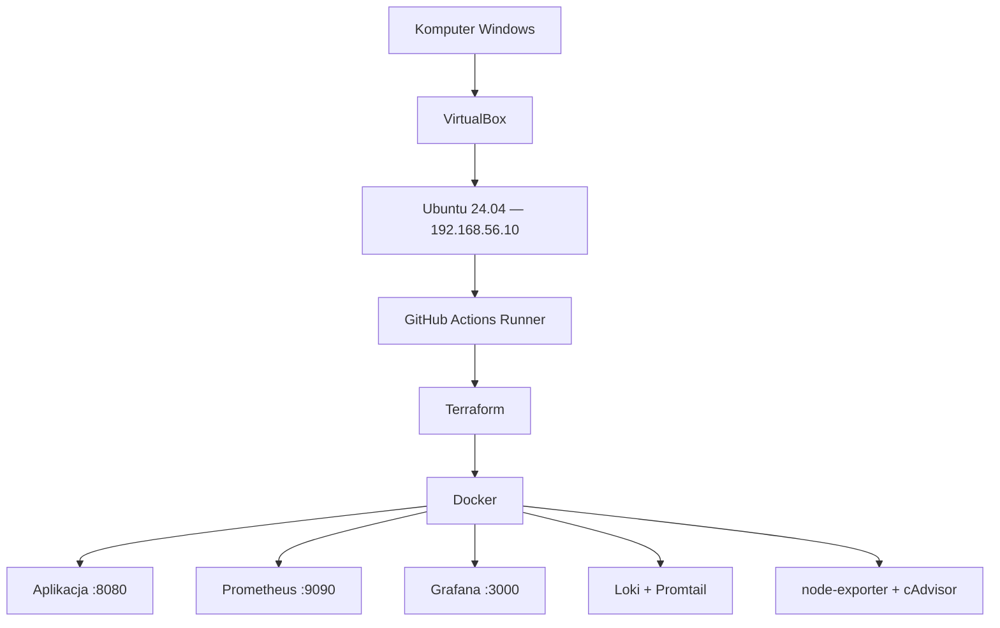

# DevOps Graduate Project — infrastruktura lokalna

Drugie repozytorium projektu zawiera kompletną infrastrukturę jako kod bez AWS.
Vagrant tworzy maszynę Ubuntu 24.04 w VirtualBox, skrypt bootstrap instaluje
narzędzia, a Terraform zarządza wszystkimi kontenerami Docker.

## Architektura



## Tworzone zasoby

- VM Ubuntu 24.04: 2 CPU, 4 GB RAM,
- prywatna sieć host-only `192.168.56.0/24`,
- Docker i Docker Compose,
- Terraform i GitHub Actions Runner,
- aplikacja Java,
- Prometheus, Grafana, Loki i Promtail,
- node-exporter i cAdvisor,
- trwałe wolumeny danych oraz sieć kontenerowa,
- automatycznie provisionowany dashboard Grafany.

## Wymagania

- VirtualBox 7,
- Vagrant,
- Git,
- konto GitHub.

Nie jest potrzebne konto AWS, karta płatnicza ani AWS SSO. Wszystkie zasoby
działają na komputerze lokalnym.

## Uruchomienie od zera

W katalogu repozytorium infrastruktury wykonaj:

```bash
vagrant up
vagrant ssh
```

Pierwsze uruchomienie pobiera obraz Ubuntu i instaluje wymagane pakiety, więc
trwa dłużej. Kolejne uruchomienia wykorzystują gotową VM.

Wewnątrz maszyny sprawdź narzędzia:

```bash
docker --version
terraform version
```

## Rejestracja GitHub Actions Runner

1. Utwórz publiczne repozytorium infrastruktury o dokładnej nazwie
   `devops-graduate-infrastructure`.
2. W repozytorium aplikacji przejdź do:
   `Settings → Actions → Runners → New self-hosted runner`.
3. Wybierz Linux i x64, a następnie skopiuj jednorazowy token rejestracyjny.
4. W zalogowanej VM uruchom:

   ```bash
   cd /vagrant
   ./scripts/register-runner.sh \
     https://github.com/TWOJ_LOGIN/devops-graduate-app \
     JEDNORAZOWY_TOKEN
   ```

Token rejestracyjny jest ważny krótko i podaje się go bezpośrednio w VM. Nie
zapisuj go w pliku ani nie wklejaj do dokumentacji.

Po rejestracji runner `devops-local-vm` powinien mieć status `Idle` oraz etykietę
`devops-local`.

## Sprawdzenie Terraform

Po utworzeniu VM można sprawdzić składnię infrastruktury bez wdrażania obrazu:

```bash
cd /vagrant
terraform init
terraform fmt -check
terraform validate
```

Pierwsze właściwe wdrożenie wykona pipeline po pushu do `main`. Przekaże obraz
opublikowany w GHCR oraz zapisze stan w
`/opt/devops-terraform/terraform.tfstate`. Ponowne `terraform apply` doprowadza
zasoby do opisanego stanu zamiast tworzyć duplikaty.

## Dostęp z Windows

| Usługa | Adres |
|---|---|
| aplikacja | `http://192.168.56.10:8080` |
| health check | `http://192.168.56.10:8080/health` |
| Grafana | `http://192.168.56.10:3000` |
| Prometheus | `http://192.168.56.10:9090` |

Domyślne konto Grafany to `admin`; hasło pochodzi ze zmiennej
`grafana_admin_password`. Dashboard `DevOps Project Overview` jest tworzony
automatycznie.

## Zarządzanie maszyną

```bash
vagrant status       # stan VM
vagrant suspend      # wstrzymanie
vagrant halt         # wyłączenie
vagrant up           # ponowne uruchomienie
vagrant provision    # ponowienie konfiguracji bootstrap
```

Całkowite usunięcie VM:

```bash
vagrant destroy
```

To usuwa maszynę i jej lokalne dane. Kod repozytorium pozostaje bez zmian.

## Stan Terraform

Stan wdrożenia jest przechowywany wyłącznie wewnątrz VM i ignorowany przez Git.
Plik `.terraform.lock.hcl` jest wersjonowany, aby każdy używał tej samej wersji
providera Docker.

## Ograniczenia bezpieczeństwa

Self-hosted runner wykonuje polecenia workflow na lokalnej maszynie. Nie należy
uruchamiać go dla niezaufanych pull requestów ani dawać nieznanym osobom prawa
pushowania. Nasz workflow kieruje na runner tylko job `deploy` po pushu do
`main`; buildy pozostałych gałęzi działają na runnerach GitHuba.
